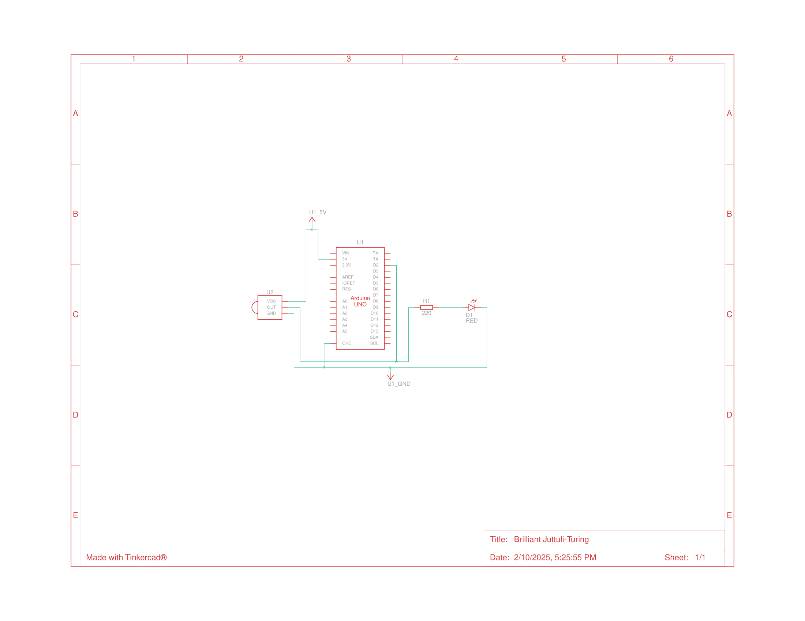

# IR Hub

An Arduino-based device to **learn, decode, and transmit IR signals** from any remote control. Perfect for home automation, universal remotes, or reverse-engineering IR protocols.

---

## Features
- **Learn IR Signals:** Capture and store IR signals from any remote control button.
- **Decode Protocols:** Identify the IR protocol (e.g., NEC, Sony, RC5) used by the signal.
- **Playback Functionality:** Retransmit stored IR signals at programmed intervals or on demand.
- **Feedback System:** Visual (LED) and serial monitor feedback for signal confirmation.

---

## Components
- **Microcontroller:** Arduino Uno/Nano
- **IR Receiver:** TSOP38238
- **IR Transmitter:** IR LED
- **Storage:** EEPROM or external memory
- **Feedback:** LED and Serial Monitor

---

## Wiring Diagram


---

## Installation
1. Clone this repository:
   ```bash
   git clone https://github.com/tlathi/IR-hub.git
